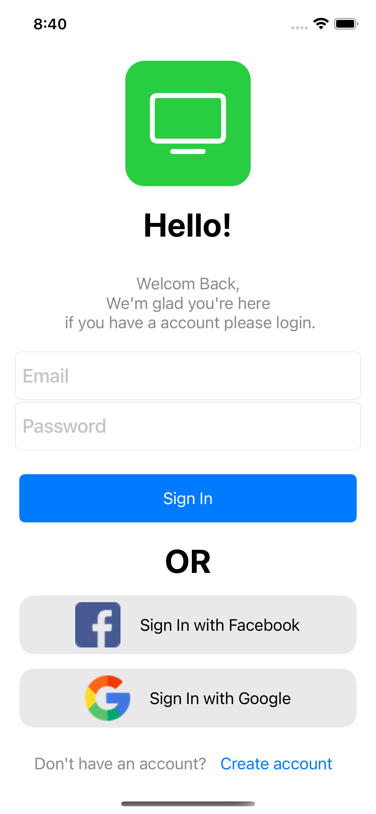
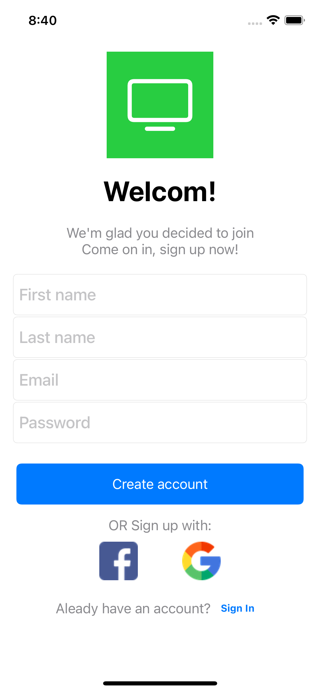

Clipstar
==========
Clipstar is an application for discovering short videos. the app uses Google Firebase services to create a database for a registration system and login to the application, you can also Login/Register using Facebook / google account or Email.
Using the Youtube API, the application knows how to pull all the short videos and display them.

## Screenshots
  

  &nbsp;
    &nbsp;
  &nbsp;

## Important
 All the keys are hidden, if you have key please uncomment the code and put you keys below.

 also the GoogleService.plist , info.plist and URL Types is hidden.

 you need also type the Google ID and Facebook ID
 also in the info file.

 ### ** WITHOUT THE KEYS AND GoogleService.plist THE APP WILL BE NOT WORKING!

 
 For any question/problem feel free to contact me.

